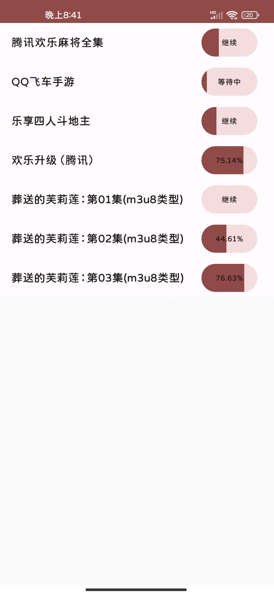

# simple-download
基于协程和Flow实现的文件下载，支持普通下载、分片下载、多线程下载、断点续传和m3u8类型文件下载

## 基本使用
```kotlin
// 创建下载任务
val downloadTask = coroutineScope.download("url")

// 监听下载进度
downloadTask.progress()
.onEach { progress ->  /* 更新进度 */  }
.launchIn(lifecycleScope)

// 开始下载
downloadTask.start()
```
### 监听下载状态
```kotlin
downloadTask.state().onEach { state ->
    when (state) {
        is State.None -> text.value = "下载"
        is State.Waiting -> text.value = "等待中"
        is State.Downloading -> {
            text.value = state.progress.percentStr()
            // 更新进度
            progress.value = state.progress.progress()
        }
        is State.Failed -> text.value = "重试"
        is State.Stopped -> text.value = "继续"
        is State.Succeed -> text.value = "完成"
    }
}.launchIn(lifecycleScope)
```
### 启动与停止
```kotlin
// 开始下载
downloadTask.start()
// 停止下载
downloadTask.stop()
// 删除下载
downloadTask.remove()
```
## DEMO
<p align="center">
  
</p>

## 参考开源
本项目是在[DownloadX](https://github.com/ssseasonnn/DownloadX)的基础上进行开发的，增加了对M3u8类型文件的下载支持